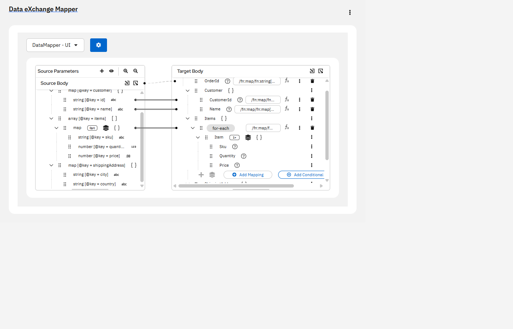
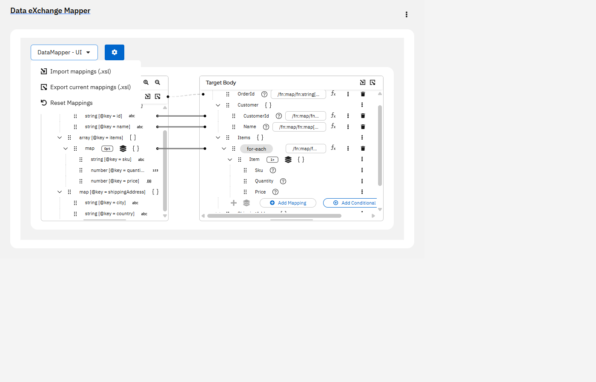

# DataMapper Web App

A web-based data mapping, data transformation, and ETL design application built on top of the Kaoto DataMapper engine.

This project enables developers, integration engineers, and data teams to visually map and transform data between JSON, XML, XSD, and other enterprise formats through a browser-based interface. Unlike the standard Kaoto Online deployment, this application exposes the full DataMapper experience, including schema-driven mapping, transformation design, and XSLT generation.

# Key Features
Visual drag-and-drop data mapping
JSON-to-XML and XML-to-JSON transformation workflows
XSD and JSON Schema support
Browser-based ETL mapping designer
Apache Camel and Kaoto integration
Automatic XSLT generation
Local execution with Docker or Flask
Persistent browser-based workspace

# Common Use Cases
Enterprise data transformation
ETL and ELT workflow design
API payload mapping
System migration projects
JSON/XML schema conversion
Apache Camel integration development
Data integration proof-of-concepts

# Why Use This Project?

The public Kaoto deployments typically disable the DataMapper functionality. This project builds Kaoto from source and exposes the complete DataMapper experience, allowing teams to design, test, and maintain transformation mappings locally without additional infrastructure.


## Keywords

Data Mapping, Data Transformation, ETL Tool, ETL Designer,
Visual Mapper, Apache Camel DataMapper, Kaoto DataMapper,
JSON Transformation, XML Transformation, XSLT Generator,
Schema Mapping, Data Integration Platform

In short, this is a Flask-based web app that hosts the **real Kaoto Online UI** (built
from source) so that the full Kaoto experience — Camel route designer
+ embedded **DataMapper** — runs locally in any browser, served by
Flask.



> **Why this exists.** Kaoto's public Docker image and the hosted
> Kaoto Online have the DataMapper view disabled. The DataMapper is
> built into the Kaoto codebase but requires a host-side
> `IMetadataApi` implementation that the Docker build doesn't provide.
> This project builds Kaoto from source (which enables DataMapper) and
> serves the static bundle from Flask. State is persisted by Kaoto in
> the browser's `localStorage` by default.

## Screenshots

| Empty state | Actions menu (import / export / reset) |
| --- | --- |
|  |  |

Drop additional screenshots into [docs/screenshots/](docs/screenshots/)
to extend this gallery.

## Architecture

```
┌──────────────────────────────────┐
│        Browser (Kaoto UI)        │
└───────────────┬──────────────────┘
                │  HTTP
┌───────────────▼──────────────────┐
│   Flask (app.py) on :5000        │
│   ─ static SPA host              │  ← .kaoto-src/packages/ui/dist
│   ─ /api/files (sandboxed)       │  optional file-bridge API
│   ─ /api/samples (sample copy)   │
│   ─ /api/health                  │
└───────────────┬──────────────────┘
                │
        workspace/  (sandboxed dir)
```

## Repository layout

```
datamapper-webapp/
├── app.py                   Flask backend (static SPA + sandboxed file API)
├── requirements.txt
├── Dockerfile               Multi-stage build (node builder → python runtime)
├── .dockerignore
├── sample/                  Demo JSON Schema + XSD + input JSON
├── workspace/               Sandboxed file storage exposed by /api/files
├── scripts/
│   ├── setup_kaoto.py       Cross-platform: clone + patch + build Kaoto Online
│   ├── kaoto.patch          The 6-file patch baking "Data eXchange Mapper" branding
│   ├── run_app.py           Cross-platform: launch Flask serving the build
│   ├── docker_build.py      Wrapper around `docker build`
│   ├── docker_run.py        Wrapper around `docker run`
│   └── setup-kaoto.ps1      Legacy PowerShell version (Windows only)
└── .kaoto-src/              (created by the script) Kaoto monorepo
    └── packages/ui/dist/    The built static Kaoto Online app
```

## Quickstart with Docker (recommended)

> Works anywhere Docker / Podman runs (Linux, macOS, Windows + WSL2).
> Only Python 3 + Docker on `PATH` are required — no Node, no yarn,
> no Python venv.

```bash
cd datamapper-webapp

# Build the image (clones Kaoto, applies scripts/kaoto.patch,
# yarn build, then assembles the slim Flask runtime). ~10–15 min.
python3 scripts/docker_build.py

# Run it.
python3 scripts/docker_run.py            # foreground, port 5000
python3 scripts/docker_run.py --port 8080 --detach
python3 scripts/docker_run.py --workspace ./workspace   # mount host dir
```

Open <http://localhost:5000>.

The image is multi-stage: a `node:20` builder produces the SPA, and a
`python:3.12-slim` runtime serves it via `gunicorn`. Final image runs
as a non-root `app` user.

Useful flags:

```bash
python3 scripts/docker_build.py --kaoto-ref 2.10.0
python3 scripts/docker_build.py --tag dxm:dev --no-cache
python3 scripts/docker_build.py --engine podman
python3 scripts/docker_run.py   --tag dxm:dev --port 8080
```

## Quickstart (no Docker)

> Works on **Windows, macOS, and Linux**. All commands below run
> through Python so you don't need PowerShell on non-Windows.
>
> Prerequisites on `PATH`: `python` 3.10+, `git`, `node` 20+ (which
> ships `corepack` for yarn).

### 1. Build the Kaoto UI from source (one-off, slow)

Disk: ~5 GB free. Time: ~10–15 min (yarn install + Vite build).

```bash
cd datamapper-webapp
python scripts/setup_kaoto.py
```

The script:

1. Verifies `corepack yarn` is available.
2. Shallow-clones `KaotoIO/kaoto` into `.kaoto-src/`.
3. Runs `corepack yarn install` (1800+ packages, ~330 MB).
4. Sets `VITE_ENABLE_DATAMAPPER_DEBUGGER=true` and
   `VITE_DATAMAPPER_ONLY=true`, then runs
   `corepack yarn workspace @kaoto/kaoto build` to produce
   `.kaoto-src/packages/ui/dist/`. Those env vars swap Kaoto's default
   "DataMapper cannot be configured in browser" placeholder for the
   real standalone **DataMapper** page, and hide the rest of the
   Kaoto navigation.

Useful flags:

```bash
python scripts/setup_kaoto.py --ref 2.10.0       # pin Kaoto version
python scripts/setup_kaoto.py --skip-install     # rebuild only (fast)
python scripts/setup_kaoto.py --clean            # wipe .kaoto-src first
```

### 2. Create the Python venv

**Windows (PowerShell):**

```powershell
python -m venv .venv
.\.venv\Scripts\Activate.ps1
pip install -r requirements.txt
```

**macOS / Linux (bash / zsh):**

```bash
python3 -m venv .venv
source .venv/bin/activate
pip install -r requirements.txt
```

### 3. Run Flask serving the Kaoto build

```bash
python scripts/run_app.py
```

`run_app.py` automatically sets `FRONTEND_DIST` to
`.kaoto-src/packages/ui/dist`. To override the port:

```bash
python scripts/run_app.py --port 8000
```

Open <http://127.0.0.1:5000>.

The DataMapper page loads immediately (no extra navigation, since
build flag `VITE_DATAMAPPER_ONLY=true` makes it the index route).

## Using the DataMapper

There are two ways to reach the DataMapper:

### A. Standalone DataMapper Debugger (fast path)

Go straight to <http://127.0.0.1:5000/#/datamapper> (or click
**DataMapper** in the left nav). This loads the
`DataMapperDebugger` page bundled with Kaoto — a self-contained
DataMapper UI with **Attach schema** buttons for the source/target
bodies, parameter management, transformation actions and zoom
controls. Use this when you only care about authoring mappings.

> This page is gated by `VITE_ENABLE_DATAMAPPER_DEBUGGER` at build
> time. `scripts/setup_kaoto.py` sets it for you. If you rebuild
> Kaoto manually, export it first or you'll see the placeholder.

### B. Drill-in from a Camel route

1. Open the **Design** page (`#/`) and create a new Camel route.
2. Add a `kaoto-datamapper` step.
3. Click the step → **Configure** → **Open Data Mapper**.
4. The DataMapper opens at `#/datamapper/<step-id>` with the route's
   metadata already wired up.

In either flow, attach source / target documents (JSON Schema / XSD).
The sample files in [sample/](sample/) work — drag them in or upload.
Draw mappings; Kaoto generates the XSLT live.

State persists in the browser (`localStorage`). To wipe, clear site data
in DevTools.

## File API (optional)

Flask exposes a sandboxed REST file API under `/api/files/*` that is
not used by the stock Kaoto build but is available for custom plugins
or scripts:

| Method | Path                         | Action                       |
| ------ | ---------------------------- | ---------------------------- |
| GET    | `/api/files`                 | list workspace files         |
| GET    | `/api/files/<rel>`           | read file                    |
| PUT    | `/api/files/<rel>`           | write file (raw or JSON)     |
| DELETE | `/api/files/<rel>`           | delete file or empty dir     |
| HEAD   | `/api/files/<rel>`           | existence check              |
| GET    | `/api/samples`               | list bundled samples         |
| POST   | `/api/samples/<name>/copy`   | copy sample into workspace   |
| GET    | `/api/health`                | health probe                 |

All paths resolve under `WORKSPACE_DIR` with path-traversal rejection.

## Configuration

| Env var                            | Default            | Purpose                                              |
| ---------------------------------- | ------------------ | ---------------------------------------------------- |
| `FRONTEND_DIST`                    | `./.kaoto-src/packages/ui/dist` | Static SPA root containing the built Kaoto UI |
| `WORKSPACE_DIR`                    | `./workspace`      | Where the file API stores data                       |
| `FLASK_PORT`                       | `5000`             | Where Flask listens                                  |
| `VITE_ENABLE_DATAMAPPER_DEBUGGER`  | (unset)            | **Build-time.** Set to `true` before `yarn build` to enable the standalone DataMapper page at `#/datamapper`. |

## Development checks

Install the runtime and test dependencies, then run the fast backend checks:

```bash
python -m pip install -r requirements.txt -r requirements-dev.txt
python -m py_compile app.py scripts/setup_kaoto.py scripts/run_app.py scripts/docker_build.py scripts/docker_run.py
python -m pytest
```

The GitHub Actions workflow runs the same compile and pytest checks on
pushes and pull requests.

## Updating to a newer Kaoto release

```bash
python scripts/setup_kaoto.py --clean --ref 2.10.0   # any branch / tag / sha
```
