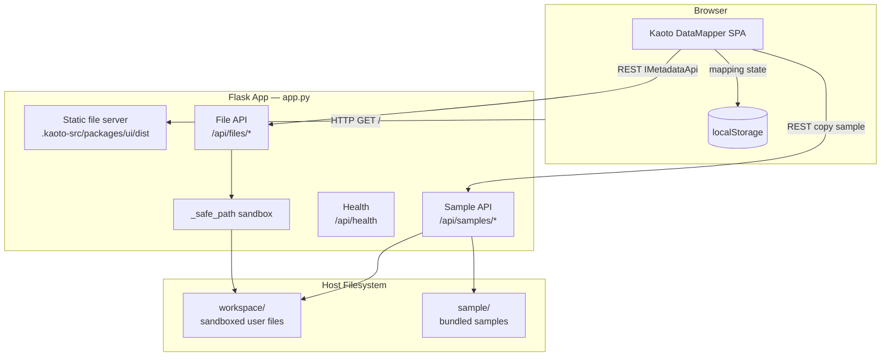
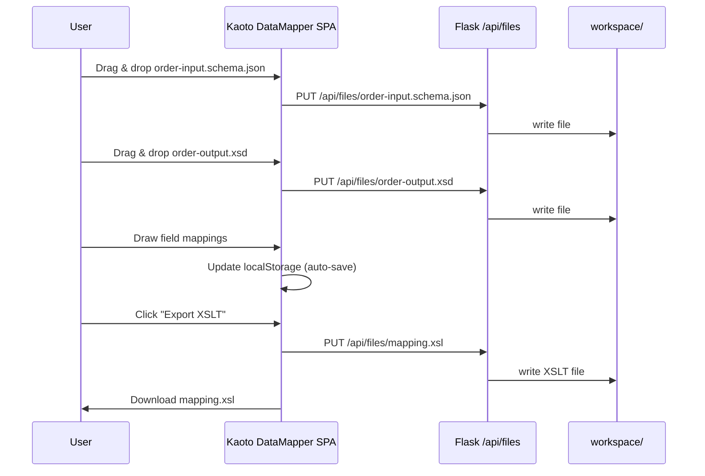

# Architecture — Data eXchange Mapper (DXM)

> Describes the system structure, component responsibilities, data flows, and key design decisions for `datamapper-webapp`.

---

## 1. High-Level Overview



---

## 2. Components

### 2.1 Kaoto DataMapper SPA (Frontend)

| Property | Detail |
|---|---|
| Source | Cloned from `KaotoIO/kaoto` into `.kaoto-src/` |
| Patch | `scripts/kaoto.patch` enables the DataMapper view and wires `IMetadataApi` to REST calls |
| Build | `corepack yarn workspace @kaoto/kaoto build` → `.kaoto-src/packages/ui/dist/` |
| Serve | Flask serves the `dist/` directory as a static SPA |
| State | Mapping design persists in browser `localStorage` (no server session) |

### 2.2 Flask Backend (`app.py`)

Responsible for:
- Serving the built SPA and its static assets.
- Implementing the sandboxed file API that the DataMapper uses as its `IMetadataApi`.
- Providing the sample library (copy into workspace).
- Exposing a `/api/health` liveness endpoint.

### 2.3 Workspace Sandbox

All file I/O from the frontend is resolved under `WORKSPACE_DIR` (`./workspace` by default). The `_safe_path()` function:
1. Rejects empty, absolute, or `..`-containing paths (HTTP 400).
2. Resolves the full path and verifies it is still under `WORKSPACE_DIR` (HTTP 400 otherwise).

This prevents path-traversal attacks (OWASP A01).

### 2.4 Setup Scripts

| Script | Purpose |
|---|---|
| `scripts/setup_kaoto.py` | Clone Kaoto source, apply patch, run Yarn build |
| `scripts/run_app.py` | Start Flask on `FLASK_PORT` (default 5000) |
| `scripts/docker_build.py` | Build the Docker multi-stage image |
| `scripts/docker_run.py` | Run the container, map `DXM_PORT` |
| `scripts/setup-kaoto.ps1` | PowerShell equivalent of `setup_kaoto.py` |

---

## 3. Data Flow — Schema Attachment & XSLT Export



---

## 4. Deployment Topologies

### 4.1 Local (Flask dev server)

```
localhost:5000
  └── python scripts/run_app.py
        └── app.py (Flask)
              ├── serves .kaoto-src/packages/ui/dist/
              └── sandboxed I/O → ./workspace/
```

### 4.2 Docker (single container)

```
host:DXM_PORT → container:5000
  └── Dockerfile (multi-stage)
        Stage 1 — Node.js builder
          clone kaoto, apply patch, yarn build
        Stage 2 — Python runtime
          COPY dist + app.py + sample/
          CMD gunicorn app:app
```

### 4.3 Docker Compose

```yaml
# docker-compose.yml (simplified)
services:
  dxm:
    image: data-exchange-mapper:latest
    ports:
      - "${DXM_PORT:-5000}:5000"
    volumes:
      - ./workspace:/app/workspace   # persist workspace between runs
```

---

## 5. Environment Variables

| Variable | Default | Description |
|---|---|---|
| `WORKSPACE_DIR` | `./workspace` | Absolute path to the sandboxed file workspace |
| `FRONTEND_DIST` | `.kaoto-src/packages/ui/dist` | Path to the built Kaoto SPA |
| `FLASK_PORT` | `5000` | Port Flask listens on |
| `DXM_PORT` | `5000` | Host port mapped by Docker / Compose |
| `DXM_REF` | `main` | Kaoto git ref to clone (tag or SHA recommended) |
| `DXM_BUILD_CONTEXT` | `.` | Docker build context |

---

## 6. Key Design Decisions

### 6.1 No custom React frontend

The project does not maintain its own React codebase. It patches and builds the upstream Kaoto UI. This minimises maintenance but couples the project to Kaoto's internal API contracts.

**Trade-off:** Upstream Kaoto changes may break the patch (`scripts/kaoto.patch`). A CI job that re-applies the patch against the pinned ref mitigates this.

### 6.2 Stateless Flask backend

All mapping state lives in the browser's `localStorage`. The Flask backend is entirely stateless (no database, no session store). This simplifies horizontal scaling and local development but means state is lost when the browser data is cleared.

### 6.3 Sandboxed file API

Rather than a generic file proxy, the API enforces a strict sandbox boundary. This is a deliberate security trade-off: the file API is safe for local use but should be protected by auth before any shared/cloud deployment.

### 6.4 XSLT 3.0 output

Generated XSLT targets XSLT 3.0 (Saxon), which supports JSON input natively. This enables JSON-to-XML transformation at runtime without pre-conversion steps, aligning with Apache Camel's Saxon processor.

---

## 7. Planned Improvements

| Item | Rationale |
|---|---|
| Pin `DXM_REF` to a known-good tag/SHA | Reproducible builds; avoid surprise upstream breaks |
| Patch drift CI check | Alert when `kaoto.patch` fails to apply to the pinned ref |
| Token-based file API auth | Required before any shared/multi-user deployment |
| Request size limits on `PUT /api/files` | Prevent abuse in shared deployments |

See [PLAN.md](../PLAN.md) for the full backlog.
